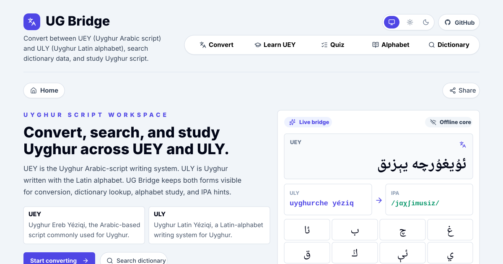

<p align="center">
  
</p>

<h1 align="center">UG Bridge</h1>

<p align="center">
  A static browser tool for Uyghur Arabic script (<strong>UEY</strong>) and
  Uyghur Latin Yéziqi (<strong>ULY</strong>).
</p>

<p align="center">
  <a href="https://ugbr1dge.web.app">Live app</a>
  ·
  <a href="#features">Features</a>
  ·
  <a href="#quick-start">Quick start</a>
</p>

<p align="center">
  
  
  
  
  
</p>

<p align="center">
  
</p>

```text
ياخشىمۇسىز  ⇄  yaxshimusiz
```

## Terminology

- **UEY** means **Uyghur Ereb Yéziqi**: the Arabic-based script commonly used
  for Uyghur.
- **ULY** means **Uyghur Latin Yéziqi**: a Latin-alphabet writing system for
  Uyghur.

## Features

- **Convert UEY ⇄ ULY** with smart direction detection, colored segment
  highlighting, IPA hints, long-text counters, conversion quality hints,
  copy/share actions, live shareable URLs, keyboard shortcuts, and `.txt`
  upload/download.
- **Look up converted words inline** by tapping output word chips that open
  dictionary results without leaving the conversion workspace.
- **Analyze full text in Reader** with side-by-side UEY/ULY views, script
  detection, word grouping, dictionary matches, simple Uyghur suffix-root
  fallback, `?view=reader&text=` share links, and direct save/study/convert
  actions.
- **Recognize UEY from images** through an experimental Image OCR input powered
  by browser-side PP-OCRv5 with Tesseract.js as a fallback. OCR runs in the
  browser, lazy-loads only when requested, applies local high-contrast
  preprocessing for Tesseract, and returns editable text before analysis.
- **Inspect the letter bridge** from ULY to UEY, including per-segment mapping,
  word-initial hamza behavior, and Uyghur letter forms.
- **Search offline dictionary data** from the home page or dictionary view by
  UEY, ULY, or English with suggestions, matched-text highlighting,
  cross-script fallbacks, exact headword-first results, curated common-word
  ranking for English lookups, typo suggestions, recent searches, saved lookup
  controls, dictionary favorites, clearer empty/no-result states, `?dict=`
  share links, saved lookup records, copy actions, and lazy-loaded static
  shards.
- **Study and practice UEY** through vowel-highlighted letter breakdowns,
  alphabet pages, browser-shaped highlighted examples, illustrated concrete
  word examples, connected joining-form samples, local word mastery/review
  state, letter progress, randomizable quiz sets, saved missed-form review, and
  UEY/ULY mini quizzes that can focus on learned letters or fall back to all 32
  sounds.
- **Customize local workflows** with browser-local custom words, recent
  conversions, ULY input helpers, a privacy-first local study profile with JSON
  export/import and no retained backend profile data, system/day/night theme
  settings, and installable PWA shell caching.
- **Render UEY consistently** with a bundled UKIJ Ekran webfont for Uyghur
  Arabic script text.
- **Surface basic project information** with a homepage disclaimer, contact
  link, copyright year, GPLv3 source license note, and dictionary data
  attribution.
- **Speak UEY text** through browser speech, local MMS, Hugging Face
  Space-style proxy, or a custom TTS endpoint.

## Quick Start

Requirements:

- Node 24 or newer
- npm

```bash
npm install
npm run dev
```

The dev server runs at <http://localhost:5173>.

Useful commands:

```bash
npm test                 # run unit tests once
npm run test:watch       # watch tests
npm run typecheck        # TypeScript check
npm run build            # production build in dist/
npm run smoke:lightpanda # Lightpanda smoke check for core browser flows
npm run ocr:fixtures     # Tesseract.js smoke check against local UEY images
npm run preview          # preview production build
npm run deploy           # build + deploy to Firebase Hosting
npm run dictionary:build # rebuild generated dictionary shards
```

## Stack

- Vite + React 18 + TypeScript
- Tailwind CSS v4 with the `@tailwindcss/vite` plugin
- Lucide React icons
- PaddleOCR.js and Tesseract.js for optional browser-side Uyghur OCR
- Vitest + Testing Library
- Firebase Hosting
- Firebase Web SDK initialized for future Auth / Firestore use
- Static app architecture; no backend is required for core features

The project targets Node 24+ so the Tailwind v4 toolchain can run on an
active LTS baseline.

## Project Structure

```text
src/
├── components/              # React UI components
├── hooks/                   # React hooks that bridge UI and pure libraries
├── lib/
│   ├── converter/           # pure UEY/ULY conversion logic
│   ├── dictionary/          # pure dictionary search helpers
│   ├── reader/              # pure reader analysis and OCR adapter
│   ├── tts/                 # TTS provider interface and implementations
│   ├── conversion-history.ts
│   ├── custom-transliterations.ts
│   ├── local-profile.ts
│   └── firebase.ts
├── App.tsx                  # view, direction, and app composition state
├── main.tsx
└── index.css

tests/                       # Vitest specs grouped by product area
├── app/                     # full app workflow tests
├── converter/               # pure UEY/ULY conversion tests
├── dictionary/              # dictionary search and panel tests
├── fixtures/ocr/uey/        # local UEY images for OCR smoke checks
├── reader/                  # Reader text-analysis tests
├── storage/                 # browser-local persistence helpers
├── study/                   # Learn, Alphabet, and Quiz tests
├── tts/                     # TTS settings, providers, and speak controls
└── ui/                      # shared input/output component tests
public/
├── dictionary/              # generated static dictionary shards
├── fonts/                   # bundled webfont assets and attribution
├── ocr-models/              # PP-OCRv5 ONNX model archives for browser OCR
├── manifest.webmanifest
├── icon.svg
└── sw.js

scripts/
├── build_dictionary_dataset.mjs
├── lightpanda_smoke.mjs
├── mms_tts_server.py
└── ocr_fixture_smoke.mjs

firebase.json
.firebaserc
AGENTS.md                    # project notes for agent workflows
SECURITY.md                  # vulnerability reporting and secret handling
```

`src/lib/` must stay pure and free of React imports. Stateful UI coordination
belongs in hooks or `App.tsx`; components should mostly receive props and emit
events.

## Conversion

### UEY → ULY

- Character mapping lives in
  [src/lib/converter/mapping-table.ts](src/lib/converter/mapping-table.ts).
- Word-initial hamza `ئ` is dropped as a vowel carrier.
- In-word hamza `ئ` converts to ULY apostrophe: `سائەت` → `sa'et`.
- Arabic punctuation (`،` `؟` `؛`) converts to Latin punctuation.
- Unknown characters pass through.
- Forward conversion outputs canonical `é` for `ې`.

### ULY → UEY

- Longest-match scan handles digraphs such as `sh`, `ch`, `gh`, `ng`, and `zh`.
- Word-initial vowels receive hamza: `alma` → `ئالما`.
- ULY apostrophe restores in-word hamza: `sa'et` → `سائەت`.
- Adjacent vowels receive an internal hamza carrier when needed:
  `saet` → `سائەت` remains accepted for compatibility.
- Case-insensitive input is accepted.
- `ë` is accepted as a compatibility alias, but `é` is the canonical ULY form.
- Latin punctuation (`,` `;` `?`) converts to Arabic punctuation.

Standard Uyghur text round-trips cleanly for common inputs:

```ts
ulyToUey(ueyToUly(uey)) === uey
```

Known caveat: Persian kaf `ک` maps forward to `k`, and reverse conversion
normalizes it to Arabic kaf `ك`.

## Dictionary

The dictionary imports the Apache-2.0 Hugging Face dataset
[`anke01/uyghur-dictionary-dataset`](https://huggingface.co/datasets/anke01/uyghur-dictionary-dataset).

The build script imports the English ⇄ Uyghur files:

- `ug-en.jsonl`
- `en-ug.jsonl`

and generates cleaned static JSON shards under `public/dictionary/`. During
generation, HTML/newline translation separators are preserved before splitting,
and parenthetical Uyghur headword annotations are stripped so descriptive notes
do not become searchable headwords.

```bash
npm run dictionary:build
```

Generated data is committed so Firebase Hosting can serve it directly. The app
does not download the whole dictionary on page load; it debounces static lookup,
lazy-loads only the relevant shard for the active query and search mode, and
keeps only query-matching candidates in memory. Manifest and shard fetches are
cached after successful loads, while transient failures are left retryable so a
temporary network error does not poison the session.

Current generated size:

- about 314k Uyghur headwords
- about 725k English definitions

## Reader and OCR

Reader is the sentence and paragraph workspace. It accepts pasted text or a
shared URL such as `?view=reader&text=سالام`, detects whether the source is UEY,
ULY, mixed, or unknown, and keeps UEY and ULY renderings visible together.
Word analysis deduplicates repeated tokens and searches the local dictionary by
ULY form. If an exact token misses, Reader tries a short list of simple suffix
roots such as `sizni` → `siz` and `kitablar` → `kitab`.

Image OCR is a Reader input mode, not a separate top-level product surface. It
tries PP-OCRv5 first through `@paddleocr/paddleocr-js`, using the mobile text
detection model plus `arabic_PP-OCRv5_mobile_rec`, which covers Uyghur Arabic
script. The PP-OCRv5 ONNX model archives are served from
`public/ocr-models/ppocrv5/` because the upstream model host does not expose the
CORS headers needed for direct browser fetches.

If PP-OCRv5 fails to initialize, fails to recognize, or returns no text, Reader
falls back to `tesseract.js` with language code `uig`. The Tesseract worker,
WASM core, and `uig.traineddata.gz` are loaded lazily from public CDNs when a
fallback run is needed, then cached by the browser/Tesseract.js where
supported.

OCR output is treated as a draft: the recognized UEY text lands in the editable
Reader text area before conversion, dictionary matching, study, or speech.
Reader applies local high-contrast preprocessing before Tesseract fallback
recognition and shows a confidence-derived quality badge so weak scans are
easier to spot before saving words.

Reader word cards can save dictionary matches or unmatched tokens directly into
the browser-local study profile as review items, without leaving the Reader
workspace.

The repo includes a small set of pure UEY image fixtures under
`tests/fixtures/ocr/uey/`. Run `npm run ocr:fixtures` to confirm Tesseract.js can
load the `uig` traineddata model and still extract Arabic-script text from
multiple sample styles. These fixtures are only for development smoke checks and
are not shipped as app assets.

## Fonts

UEY text uses a bundled `UKIJ Ekran` webfont subset from the
[UKIJ Uyghur Unicode fonts page](https://ukij.org/fonts/) so Uyghur Arabic
script renders consistently across operating systems. The UKIJ page states that
its fonts are distributed under LGPL and SIL Open Font License terms.
Attribution details live in [public/fonts/README.md](public/fonts/README.md).

## Text To Speech

Speech always receives the **UEY Arabic-script text**, even when the visible
input is ULY. The converter sends the original UEY input for UEY → ULY mode and
the converted UEY output for ULY → UEY mode.

The default provider is the browser's Web Speech API. Most desktop browsers do
not ship a Uyghur voice, so the UI warns when no `ug-*` voice is available.
If browser voice detection fails, the app treats that as no Uyghur voice rather
than leaving speech status stuck in an unknown state. In practice, browser voice
availability is the main speech-quality bottleneck; custom API and MMS routes
can improve quality only as much as their backing model and voice support.

The app also supports a user-provided TTS API from the **TTS API** control. The
endpoint should accept:

```http
POST /api/tts
Authorization: Bearer <optional key>
Content-Type: application/json

{ "text": "ياخشىمۇسىز", "voice": "ug-CN-YilianNeural" }
```

and return audio such as `audio/wav` or `audio/mpeg`.

Switching TTS back to browser speech clears saved API endpoint, key, and custom
voice settings so stale API configuration does not linger in browser mode.

For local neural TTS, run the Uyghur MMS-TTS model:

```bash
npm run tts:mms
```

Then point the frontend at it in `.env.local`:

```bash
VITE_TTS_ENDPOINT=http://127.0.0.1:7861/api/tts
```

The MMS model is
[`facebook/mms-tts-uig-script_arabic`](https://hf.co/facebook/mms-tts-uig-script_arabic).
It is useful for local or separate-server experiments, but its license is
CC-BY-NC-4.0, so treat it as non-commercial unless replaced with a
commercial-friendly model.

## Configuration

Environment variables go in `.env.local` and are ignored by git. See
[.env.example](.env.example) for the supported Firebase and TTS settings.
See [SECURITY.md](SECURITY.md) for vulnerability reporting and secret-handling
guidance.

Firebase Web `apiKey` values are public project identifiers, not secrets.
Real access must be protected with Firebase Security Rules and Authentication.

## Buy Me a Coffee

UG Bridge uses Ko-fi's official image button for widget ID `M7U3219YMD`,
anchored to the bottom-right of the page. It opens Ko-fi in a new tab, and the
footer keeps a direct profile link as a fallback. UG Bridge does not process
payments or store payment details.

## Privacy and Data

Core conversion, Reader analysis, dictionary lookup, study tools, custom words,
and recent history run in the browser. Custom words, history, study progress,
theme mode, and TTS settings are stored locally in the user's browser storage.
Stored values are normalized on load, and invalid entries are ignored instead
of being restored into the UI.

The app sends text to a network service only when a user configures or selects
a TTS provider that requires an endpoint. Image OCR downloads PP-OCRv5 runtime
assets on demand and may download Tesseract assets and Uyghur traineddata from
public CDNs when fallback is needed, but image recognition itself runs in the
browser. The optional support button loads its image from Ko-fi's CDN.

## Deployment

Firebase Hosting serves the static `dist/` build.

One-time login:

```bash
npx firebase-tools login
```

Deploy:

```bash
npm run deploy
```

The command runs `tsc -b && vite build` and deploys the result using the project
configured in [.firebaserc](.firebaserc).

## Testing

The test suite covers converter behavior, round-trip expectations, IPA hints,
alphabet data, illustrated examples, connected form samples, dictionary search,
cross-script fallbacks, typo suggestions, retryable shard loading, dictionary
panel interactions, Reader text analysis, app conversion workflows, shareable
URL state, keyboard shortcuts, text input/output controls, custom
transliterations, history, learning progress, speech controls, and TTS settings.
Lightpanda smoke checks cover the homepage, shared conversion URLs, Reader
shared text and Image OCR entry, and dictionary `?dict=` result rendering in a
lightweight browser runtime. Real-browser smoke checks are still useful for
responsive navigation, especially clipboard, dictionary shard fetches,
recent/favorite dictionary controls, quiz interactions, and mobile tab fit.

```bash
npm test
npm run typecheck
npm run build
npm run smoke:lightpanda
```

## License

Application source is licensed under the
[GNU General Public License v3.0 only](LICENSE) (`GPL-3.0-only`).
Redistributed modified versions must remain under GPLv3 and include source
code. GPLv3 does not prohibit commercial use by itself.

The generated dictionary shards in `public/dictionary/` are derived from the
Apache-2.0 [`anke01/uyghur-dictionary-dataset`](https://huggingface.co/datasets/anke01/uyghur-dictionary-dataset).
Keep that attribution when redistributing the generated data.
